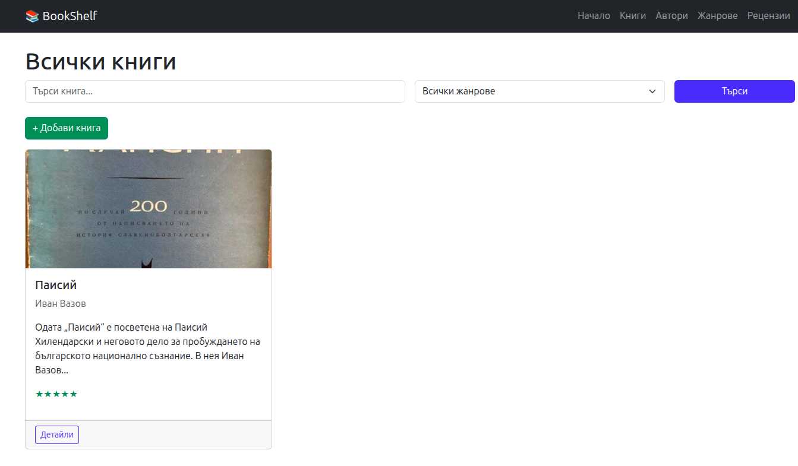
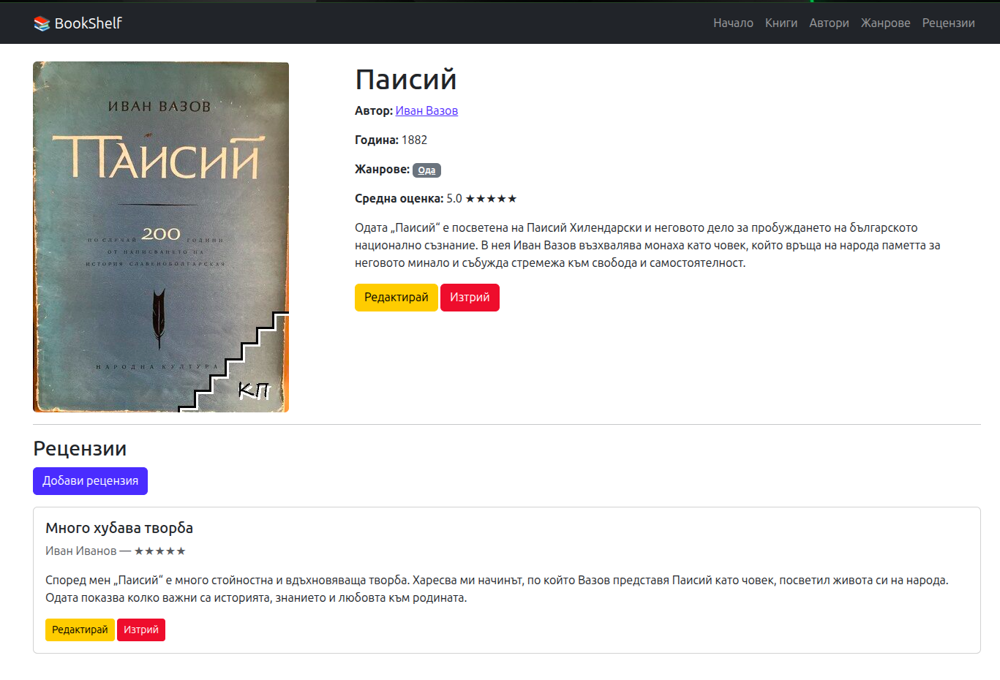
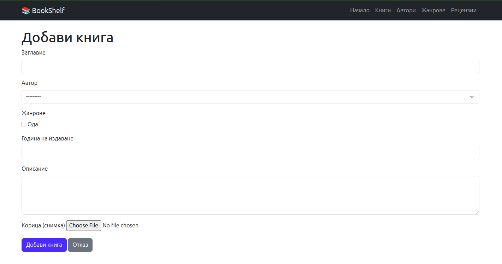

# Bookshelf

A Django web application for managing a personal book collection with authors, genres, and reviews.

## Features

- **Books** - title, author, genres, published year, description, cover image, ISBN, and average rating
- **Authors** - first/last name, bio, and birth year
- **Genres** - categorize books by genre with book count
- **Reviews** - rate books from 1 to 5 stars with a title and written review; star display included

## Tech Stack

- Python / Django 6.0
- PostgreSQL
- Pillow (cover image handling)

## Setup

1. Clone the repository and create a virtual environment:
   ```bash
   git clone https://github.com/IskrenTodorov/bookshelf-project.git
   cd bookshelf-project
   python -m venv venv
   source venv/bin/activate  # Windows: venv\Scripts\activate
   ```

2. Install dependencies:
   ```bash
   pip install -r requirements.txt
   ```

3. Configure your database in `bookshelf_project/settings.py`:
   - Set `NAME`, `USER`, `PASSWORD` to match your local PostgreSQL setup.

4. Apply migrations:
   ```bash
   python manage.py migrate
   ```

5. Run the development server:
   ```bash
   python manage.py runserver
   ```

The app will be available at `http://127.0.0.1:8000/`.

## Screenshots

### Book List


### Book Detail


### Add Book


## Project Structure

```
bookshelf-project/
├── books/      # Book and Author models, views, forms
├── genres/     # Genre model
├── reviews/    # Review model with star rating display
└── templates/  # HTML templates
```